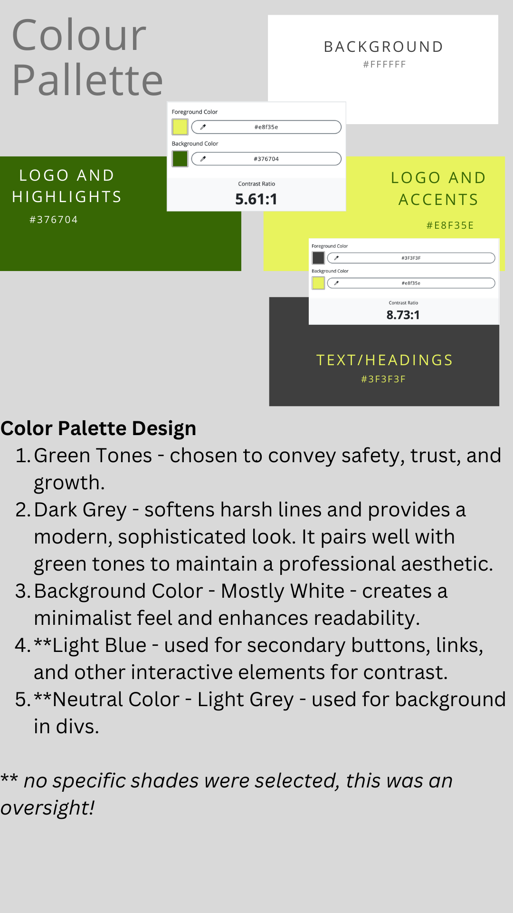

# Safeguarding - 1st Independent Project 

### Visit Our Deployed Website
Check out the live site [here](https://jesskins.github.io/safeguarding/) for more information on our safeguarding initiatives and real-life success stories.

## Brief introduction

This website has a general demographic aim, it was not specified for adults or children to provide a good start point for all. Please navigate through the index (Home) page and view the stories on the "Stories" Page. All other links go to external sites which contain relevant information used due to time constraints.

Enjoy!! Thank you. 

# How to Use Safeguarding 

Please follow these simple instructions to correctly use this website. ?? 

### User Stories

1. **Educational Videos** *(Must)*
   - **Story**: *As a casual user, I want to watch educational videos about safeguarding so that I can understand its importance and how it works.*
   - **Status**: Done, embedded video featured on the homepage.

2. **Mobile Accessibility** *(Must)*
   - **Story**: *As a mobile user, I want the website to be accessible and easy to navigate on my phone so that I can get information on the go.*
   - **Status**: Done, website is accessible on mobile.

3. **FAQs on Safeguarding** *(Could)*
   - **Story**: *As a concerned citizen, I want to read FAQs on safeguarding so that I can understand how to act in different scenarios.*
   - **Status**: Not done - time constraints.

4. **Understanding Policies** *(Could)*
   - **Story**: *As a user, I want to understand safeguarding policies, so I feel assured of my safety.*
   - **Status**: Part-done, link to government policy website in place but not clear and easy to understand, saved for future update.

5. **Safeguarding Checklist** *(Could)*
   - **Story**: *As a volunteer, I want a checklist of safeguarding practices so that I can be prepared during my activities.*
   - **Status**: Not done - would have loved to create a downloadable toolkit but ran out of time.

6. **Sections on Safeguarding Basics** *(Should)*
   - **Story**: *As a concerned parent, I want clear sections on safeguarding basics to ensure my child's safety.*
   - **Status**: Partly done - added a link to NSPCC.

7. **Success Stories** *(Should)*
   - **Story**: *As a youth worker, I want to find stories of successful safeguarding interventions so that I can be inspired and informed.*
   - **Status**: Done, featured on the stories page.

8. **Reporting Concerns** *(Must)*
   - **Story**: *As a community member, I want to know how to report safeguarding concerns so that I can contribute to community safety.*
   - **Status**: Partly done, linked to an external webpage for reporting.

9. **Signs of Abuse** *(Should)*
   - **Story**: *As a guardian, I want to learn the signs of abuse so that I can protect my dependent.*
   - **Status**: Not done - time constraints.

10. **Contact Form** *(Should)*
    - **Story**: *As a user, I want to have a contact form so that I can reach out with questions or concerns about safeguarding.*
    - **Status**: Not done.

## Wireframes 

Nothing that I do can seem to make this work on the document... I really fell out with Balasamiq, and can't seem to get a photo from my phone of the paper copy to work. SORRY!!!!

The following PDF contains the wireframes created for the project.
 ### Wireframe Document 
 You can view the wireframes by downloading the PDF here: [Wireframes PDF](docs/wireframe.pdf)

## Colours 

Accessible web testing:

# Testing 
HTML Validation 

CSS Validation 

Lighthouse Audits 

**Desktop**

**Smaller Devices**

# Bugs 

**404 not found**
- Ironically, I haven't been able to link the 404.html to the server, so no personalised 404 message unfortunately. This is not a priority and can be left for a future update. 

**General formatting**
- Formatting of font, and some features have not been consistently applied. This could do with going over to override some futher elements which have been targetted by bootstrap. 

**Performance and accessibility**
- Performance and accessibility could and should be improved. There are sections of code which are not really needed/can be cut down to improve speed. Some content missing accessibility labels, headers which do not follow in perfect order. Not finished due to time constraints. 

## Current Website Features

1. **Home Page**
   - Introduction to safeguarding.
   - Embedded educational video explaining the importance and workings of safeguarding.

2. **Mobile Accessibility**
   - Responsive design ensuring the website is accessible and easy to navigate on both mobile devices and larger screens.

3. **About Section**
   - Short description on Safeguarding, and relevant links to learn more.
   - Links to external resources for further reading.

4. **Stories Page**
   - Collection of real-life success stories highlighting the impact of safeguarding measures.

5. **Story Form**
    - Form to allow users to submit their own experience, and hopefully become more involved in the cause.

6. **Resource Links**
   - Quick access to safeguarding resources for adults and children.
   - Links to external websites, including government policy pages and NSPCC (already mentioned above).

7. **Reporting Concerns**
   - External link for reporting safeguarding concerns to appropriate authorities, in Bristol that is.

8. **Design Elements**
   - Clean and minimalist design with a white background for readability.
   - Green tones to convey safety and trust.
   - Grey accents for a softer modern look.

## Future features
- Working 404 Not Found page.
- Signs of abuse - video link and summary to go below "what is safeguarding" section. 
- Toolkit and prep list to ensure best able to safeguard. 
- Forum and FAQ section specifically to discuss topic.

# Tablet and Mobile View 

## Contributing

Pull requests are welcome. For major changes, please open an issue first
to discuss what you would like to change.

Please make sure to update tests as appropriate.

# Credits 

### Special Thanks 
A big thank you to Microsoft Copilot for providing invaluable assistance in developing and enhancing this safeguarding project. Your support and guidance were instrumental in refining our website, ensuring it meets high standards of performance, accessibility, and user experience.
(written by Copilot)

### Bootstrap 
This project uses Bootstrap to help design a responsive and visually appealing interface. Bootstrap's components and grid system made it easier to create a consistent and flexible layout across different devices. 
- [Bootstrap](https://getbootstrap.com/) - Version: Bootstrap 3.2 (used for this project)

### External Resources
Our project leverages information and resources from the following external links:
- [NSPCC](https://www.nspcc.org.uk) - National Society for the Prevention of Cruelty to Children, providing essential resources and information on safeguarding.
- [Gov.uk Safeguarding Policies](https://www.gov.uk/safeguarding) - Government guidelines and policies on safeguarding.
- [YouTube Educational Video](https://www.youtube.com/watch?time_continue=1&v=Mjo7Kz_4cfk&embeds_referring_euri=https%3A%2F%2F8000-jesskins-safeguarding-m0kciv1cnsb.ws.codeinstitute-ide.net%2F&source_ve_path=Mjg2NjY) - Source of the educational video embedded on our homepage. 
- [YouTube](https://www.youtube.com) - Platform for educational videos embedded in
- [YouTube - Real Safeguarding Stories](https://www.youtube.com/@realsafeguardingstories) - Source of real-life safeguarding stories featured on our website.

I do not claim ownership of any external content and give full credit to the respective owners and creators.

Media references 
**Acknowledgements**
I do not claim any of the images or icons used as my own, even the designs which I did make myself I do not claim intellectual property of. 

## Image Credits

I would like to acknowledge the following sources for the images used in our project:

- **Safeguarding Logo**: Used across the website.
  - Source: Created by Me (Jess) by editing with (canva)[https://www.canva.com/] and using the base icon from Freepik [https://id.freepik.com/v2/log-in?client_id=flaticon&lang=en&_gl=1*ifdr68*test_ga*MTAxMDAyNjYyMy4xNzI4NTU0OTA3*test_ga_523JXC6VL7*MTczMTMyMzA1MS4zLjEuMTczMTMyMzA5MS4yMC4wLjA.*fp_ga*MTAxMDAyNjYyMy4xNzI4NTU0OTA3*fp_ga_1ZY8468CQB*MTczMTMyMzA1Mi4zLjEuMTczMTMyMzExNy42MC4wLjA.]

- **Home and Stories Page Hero Image**: Abstract line drawing and raised hands.
  - Source: [https://www.canva.com/].

- **Responsive Design Showcase**: Used in the README.md.
  - Source: [https://ui.dev/].

- **Success Stories Section Images**: Displayed on the stories page.
  - Source: [https://www.shutterstock.com/image-vector/set-headshot-avatars-people-different-ages-2148038175].

- **Validated Index HTML**: Screenshot for validation section.
  - Source: Self-generated from the W3C Markup Validation Service.

- **Validated CSS**: Screenshot for validation section.
  - Source: Self-generated from the W3C CSS Validation Service.

- **Lighthouse Audits**: Screenshots showing Lighthouse results.
  - Source: Self-generated from Google Chrome's Lighthouse audit tool.

**Inspirations**

This project drew inspiration from the following websites, which provided valuable insights and resources on safeguarding:

- [Respect Phoneline](https://respectphoneline.org.uk/contact-us/) - Offering support and advice for those involved in domestic abuse situations.
- [Goal Us Safeguarding](https://www.goalus.org/safeguarding/) - Providing comprehensive safeguarding guidelines and policies.

## Licenses

I assume provided by Code Institute
