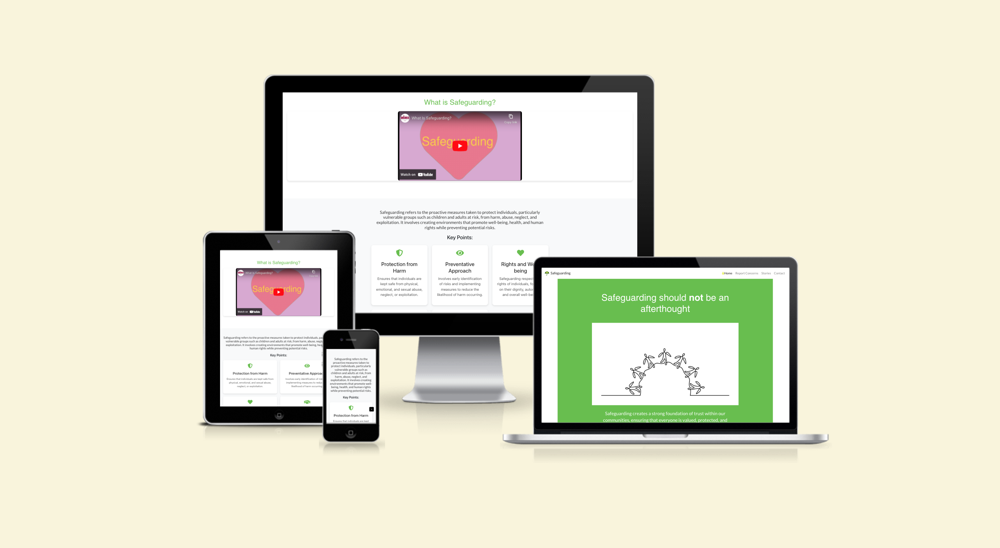
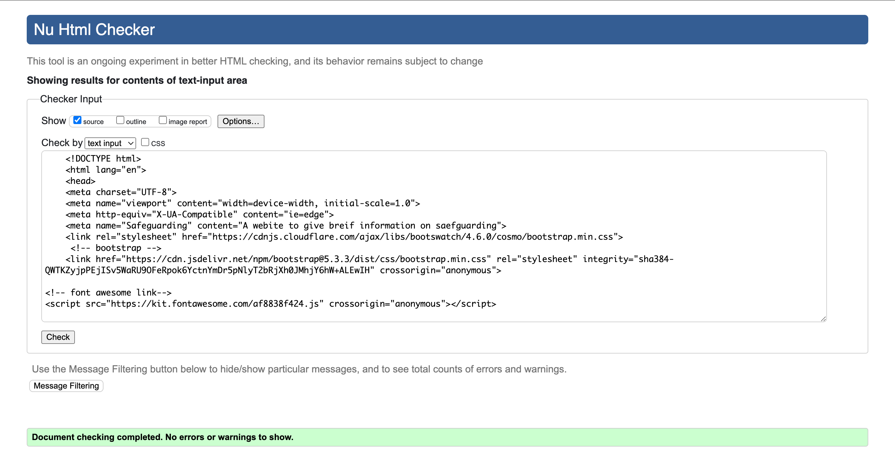
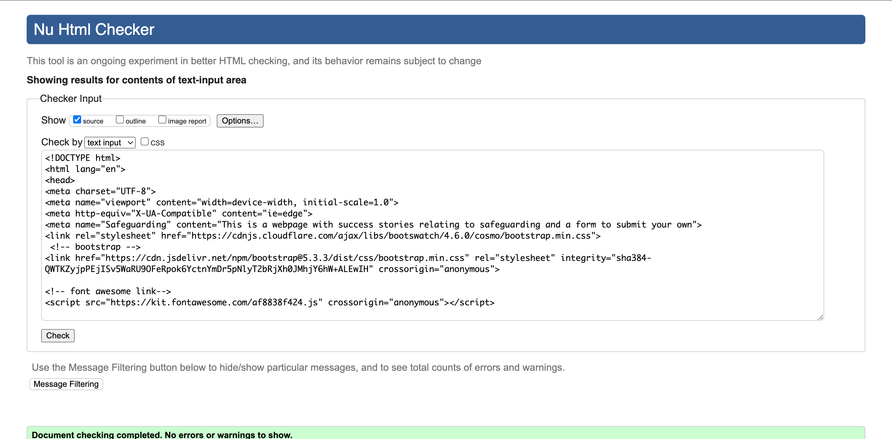
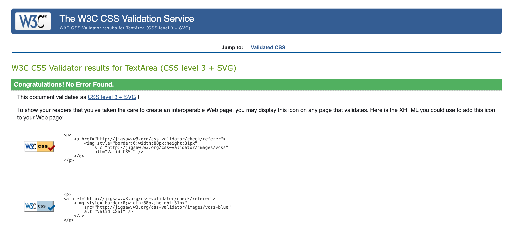
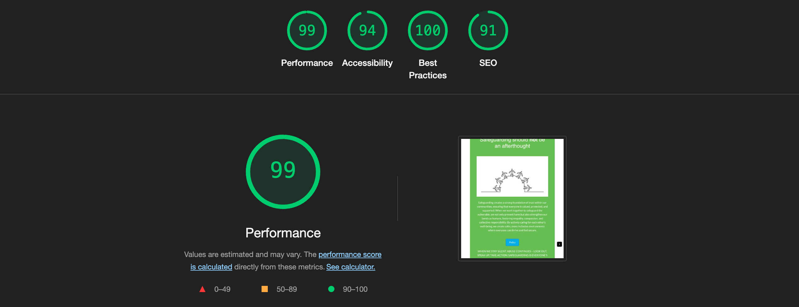
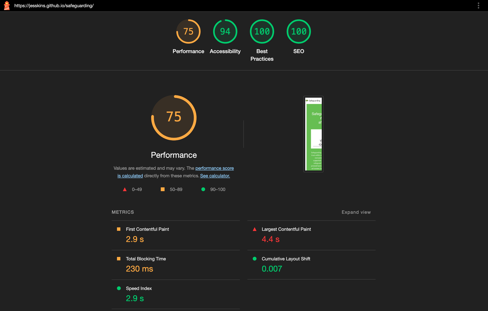

# Safeguarding - 1st Independent Project 

### Visit Our Deployed Website
Check out the live site [here](https://jesskins.github.io/safeguarding/) for more information on our safeguarding initiatives and real-life success stories.

## Brief introduction

[A brief description of this project]. This project was made using the following technologies:
- VS Code (browser)
- CSS 
- HTML
- Bootstrap 3.2 
- MIRO
- Balsamiq 
- Other software ...?

[Jump to licence and copyright] (insert internal link here)

# How to Download Safeguarding

Please follow these simple instructions:

#How to Use Safeguarding 

Please follow these simple instructions to correctly use this website. 

## contents 

# UX

## User Stories 

**User Stories**
- As a casual user, I want to watch educational videos about safeguarding so that I can understand its importance and how it works. - done, embedded video featured on homepage.
- As a mobile user, I want the website to be accessible and easy to navigate on my phone so that I can get information on the go. - Done, website is accessible on mobile. 
- (Could) As a concerned citizen, I want to read FAQs on safeguarding so that I can understand how to act in different scenarios. Not done - time constraints. 
- (Could) As a user, I want to understand safeguarding policies, so I feel assured of my safety. - Part-done, link to govenment policy website in situ but not clear and easy to understand, save for future. 
- (Could) As a volunteer, I want a checklist of safeguarding practices so that I can be prepared during my activities. Not done - would have loved to do a downloadable took kit but ran out of time. 
- (Should) As a concerned parent, I want clear sections on safeguarding basics to ensure my child's safety. Party done - added link to NSPCC
- (Should) As a youth worker, I want to find stories of successful safeguarding interventions so that I can be inspired and informed. - Done, in stories page.
- (Must) As a community member, I want to know how to report safeguarding concerns so that I can contribute to community safety. Done - partly, have linked to an external webpage which allows this to be reported.
- (Should) As a guardian, I want to learn the signs of abuse so that I can protect my dependent. Not done - time constraints.
- (Should) As a user, I want to have a contact form so that I can reach out with questions or concerns about safeguarding. - Not done.

## Wireframes 

## Design 
These were my decisions re the design. 

## Colours 

Accessible web testing:
- light green and white not acceptable 

# Testing 
HTML Validation 

CSS Validation 

Lighthouse Audits 

**Desktop**

**Smaller Devices**

# Bugs 

**404 not found**
- Ironically, I haven't been able to link the 404.html to the server, so no personalised 404 message unfortunately. This is not a priority and can be left for a future update. 

**General formatting**
- Formatting of font, and some features have not been consistently applied. This could do with going over to override some futher elements which have been targetted by bootstrap. 

# Current Website features 

## Future features
- Working 404 Not Found page.
- Signs of abuse - video link and summary to go below "what is safeguarding" section. 
- Toolkit and prep list to ensure best able to safeguard. 
- Forum and FAQ section specifically to discuss topic.

# Tablet and Mobile View 

## Contributing

Pull requests are welcome. For major changes, please open an issue first
to discuss what you would like to change.

Please make sure to update tests as appropriate.

# Credits 

### Special Thanks 
A big thank you to Microsoft Copilot for providing invaluable assistance in developing and enhancing this safeguarding project. Your support and guidance were instrumental in refining our website, ensuring it meets high standards of performance, accessibility, and user experience.
(written by Copilot)

Content references 
Media references 
**Acknowledgements**
I do not claim any of the images or icons used as my own, w

## Licenses

[MIT](https://choosealicense.com/licenses/mit/)
